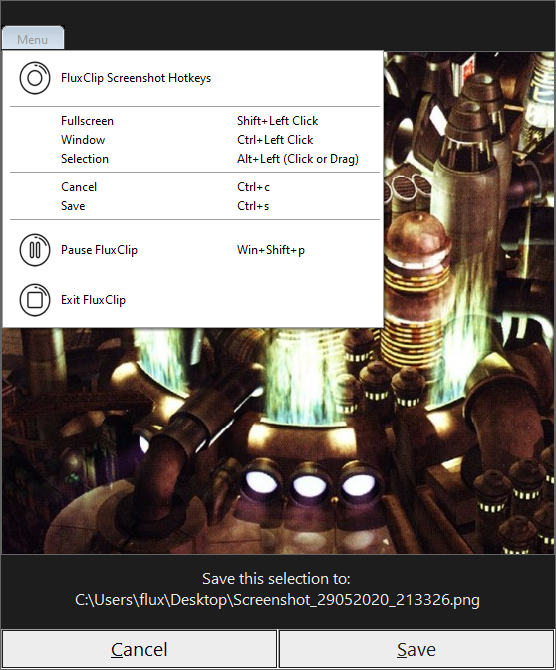

# FluxClip

Screenshot utility for Windows.

## Table of Contents
1. [Motivation](#Motivation)
2. [Features](#Features)
3. [Usage](#Usage)
   1. [Hotkeys](#Hotkeys)
      1. [Anywhere](#Anywhere)
      2. In [Selection](#Selection) Preview
4. [Downloads](#Downloads)/Files
   1. [Compiled](#Compiled) Executables
   2. [Source](#Source) Files
5. [Media](#Media)
6. [Plans](#Plans)
7. [License](#License)

## Motivation 

Windows built-in methods for taking screenshots are fine, but I wanted a way to be able to have more control over making area selections because I take LOTS of screenshots and I like better precision and control.

## Features 

Like most sceenshot tools you have 3 methods of taking screenshots:

1. Fullscreen (Desktop)
2. Window (Client/Gui)
3. Selection (Click and Drag)

My utility adds add a secondary Selection method:

4. Selection (Select Points)
   
Sorry, no free-form... yet.

Only the selection methods show a preview.

## Usage 

***FluxClip*** runs in the *Windows System Tray* and can be accessed with hotkeys. Hotkey Detection can be toggled by a hotkey or from the *System Tray* or gui (in selection preview) menu. All pitcures save as *Screenshot_\<timestamp\>.png* on the user's Desktop.

This is an ***AutoHotkey*** program and can either be ran by my single file, compiled executables or from the multiple source script files.

### Hotkeys 

#### Hotkeys - Anywhere 

Action | Hotkey
---: | :---
Pause detection | [Win]+[Shift]+p
Fullscreen Clip | [Shift]+Left Click
Window Clip | [Control]+Left Click
Selection Clip - Drag | [Alt]+Left Click - Drag
Selection Clip - Click | [Alt]+Left Click - Point A; then Point B

Notes:
- Point B can be changed at any time and as many times as you want as long as the [Alt] key is still held down.
- When using the Drag method; if the selection looks strange and overlays your area make sure you let go of the mouse button befor letting go of [Alt].

#### Hotkeys - In Selection preview 

All the normal hotkeys plus:

Action | hotkeys
---: | :---
Cancel | [Control]+c
Cancel | [Esc]
Save | [Control]+s

## Downloads/files 

### Compiled Executables 

### Source Files 

## Media 

### Preview of selection

### Video

<a href="https://youtu.be/SU5jeWK9844" target="_blank">Preview - YouTube</a>

<a href="https://lateralus138.github.io/Media/FluxClip2ndPreview/" target="_blank">Preview - My Site</a>

## Plans 

Future plans to add free-form selection and a *Python* version.

## [License](./LICENSE) 

>This program is free software: you can redistribute it and/or modify it under the terms of the GNU General Public License as published by the Free Software Foundation, either version 3 of the License, or (at your option) any later version.

>This program is distributed in the hope that it will be useful, but WITHOUT ANY WARRANTY; without even the implied warranty of MERCHANTABILITY or FITNESS FOR A PARTICULAR PURPOSE.  See the GNU General Public License for more details.